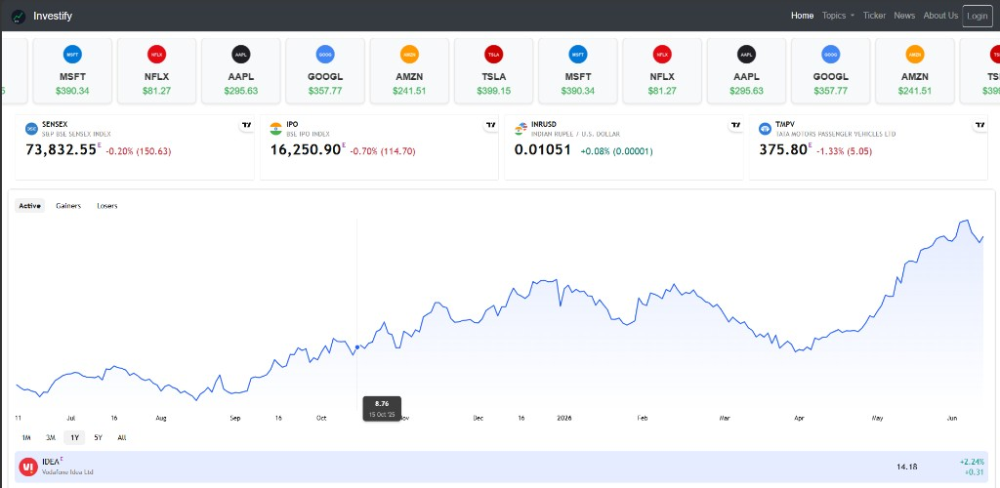
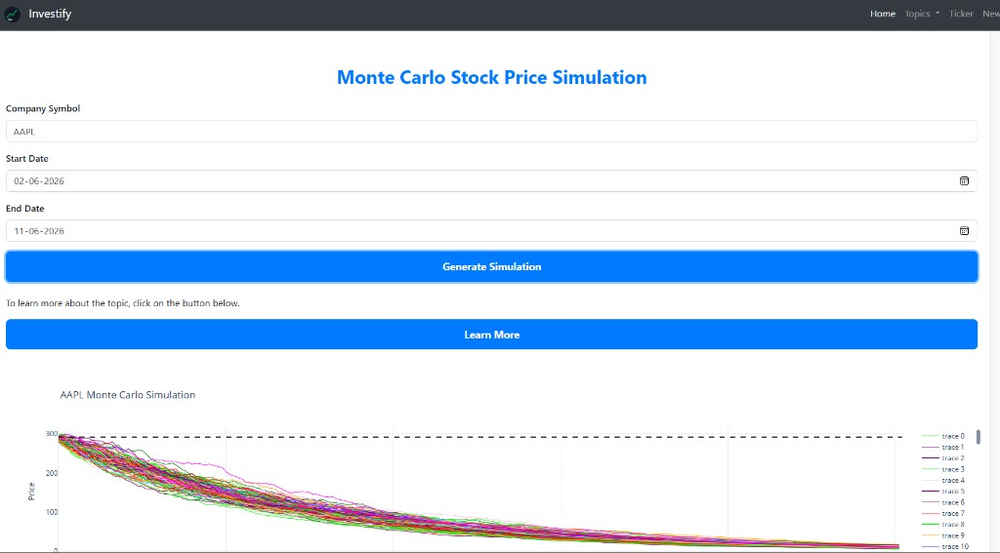
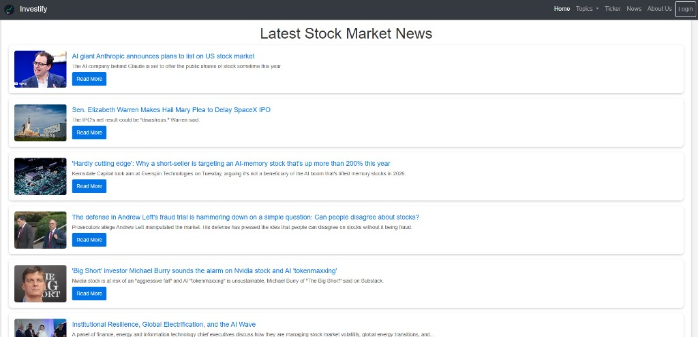

# 📈 Investify – Your Smart Financial Learning Companion

**Investify** is an educational, investor-friendly web application that empowers users to track, simulate, and analyze stock and forex portfolios with interactive tools, real-time data, and powerful financial models.

> 🚀 Learn. Invest. Simulate. Grow.

---

## 📸 Screenshots

### Home Dashboard


### Monte Carlo Simulation


### Stock Market News


---

## 🧠 Why Investify?

Traditional investing platforms focus on trading — Investify focuses on **learning**.

Built for students, enthusiasts, and curious minds, Investify helps users understand market dynamics through:
- Real-time data visualization
- Interactive simulations
- Fundamental financial models like Black-Scholes
- Custom portfolio tracking

---

## 🛠️ Features

- 📊 **Live Charts**  
  View real-time **stock and forex** data in line, candlestick, and bar chart formats.

- 💼 **Portfolio Manager**  
  Add stocks with custom purchase times and amounts. Automatically calculate **profit/loss** based on current market prices.

- 🔍 **Candlestick Pattern Explorer**  
  Visualize and learn common technical patterns using historical stock data.

- 🧪 **Monte Carlo Simulation**  
  Simulate thousands of future price paths for a stock to understand **probabilistic outcomes**.

- 🧮 **Black-Scholes Calculator**  
  Learn how option prices are derived using the **Black-Scholes Model**, complete with explanations.

- 🔐 **User Authentication**  
  Sign up, log in, and securely manage personal portfolios using session-based authentication.

- 📱 **Responsive UI**  
  Fully responsive interface built with modern frontend tools for a smooth experience on all devices.

---

## 🚧 How to Run Locally

1. **Clone the repository**
   ```bash
   git clone <your-repo-url>
   cd Investify-Stock-Market-Website-master
   ```

2. **Install dependencies**
   ```bash
   pip install flask flask-cors yfinance plotly numpy pandas scipy sympy bcrypt requests pillow
   ```

3. **Run the application**
   ```bash
   python MainApp.py
   ```

4. **Open in browser**  
   Visit [http://127.0.0.1:5000](http://127.0.0.1:5000)

---

## 🧰 Tech Stack

- **Backend:** Flask, SQLite
- **Data:** yfinance, NewsAPI
- **Visualization:** Plotly
- **Frontend:** HTML, Bootstrap, JavaScript
